<p align="center">
  <a href="" rel="noopener">
 </a>
 </a>
</p>

<h3 align="center">logseq-plugin-gpt3-openai</h3>

<div align="center">

[]()
[](https://github.com/briansunter/logseq-plugin-gpt3-openai)
[](https://github.com/briansunter/logseq-plugin-gpt3-openai)
[](/LICENSE)

</div>

---

<p align="center"> A plugin for GPT-3 AI assisted note taking in Logseq
    <br>
</p>

## Demo


# Usage

##  `gpt`

To bring up the gpt popup, use the keyboard shortcut `cmd+g`, or select `gpt` from the block or slash menu.

If you are currently in a block, the plugin will use the text in the block as input to the prompt.

If you are not in a block, the plugin won't add any additional input text to your prompt, and will append the results of the prompt to the bottom of the page.

After selecting the prompt and generating a response, a preview of the response will be shown in the popup. You can click the `Insert` button or press the enter key to insert the response into the page. 

You can also click the `Replace` button to replace the selected block with the response.

If you don't like the response, you can click the `Regenerate` button to generate a new response.
### Custom prompts
After you open the popup, you can write any text you want to use as the prompt.

For example you can write `explain this to a 5 year old` and the plugin will generate a response that is easier to understand.
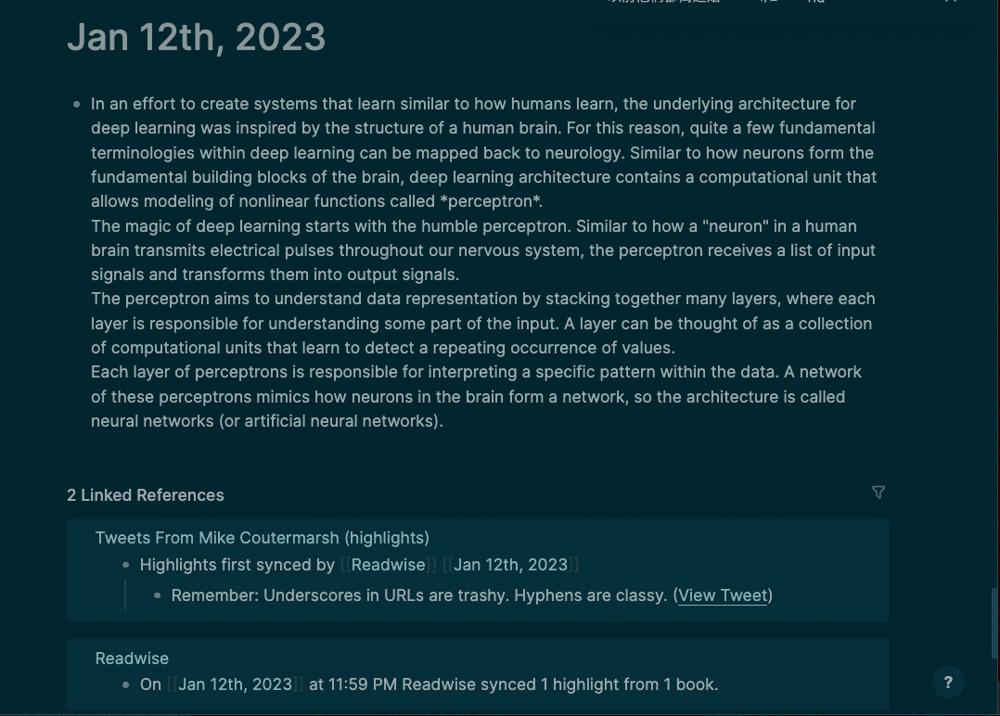
### Built-in prompt templates
There are a number of built in prompt templates that you can use to generate text. These are useful for generating outlines, summaries, and other tasks.


#### Most important ideas

### User prompt templates
You can also create your own custom prompt templates.
To do this, you create a block with the `gpt-template::` property. The template will be added to the list of templates in the gpt popup. 


The `gpt-template::` property is the name of the prompt template.

In a block nested underneath the template block, create a code block in triple backticks with the language set to `prompt`. The text in the code block will be used as the prompt. Make sure the code block is in its own block indented underneath the template block.

<pre>
```prompt
Rewrite text as a dialog between a teacher and a student:
```
</pre>

For example, you can create a template like this:

<pre>
# Student Teacher Dialog
  gpt-template:: Student Teacher Dialog
  ```prompt
    Rewrite text as a dialog between a teacher and a student:
  ```
</pre>
#### Student teacher dialog
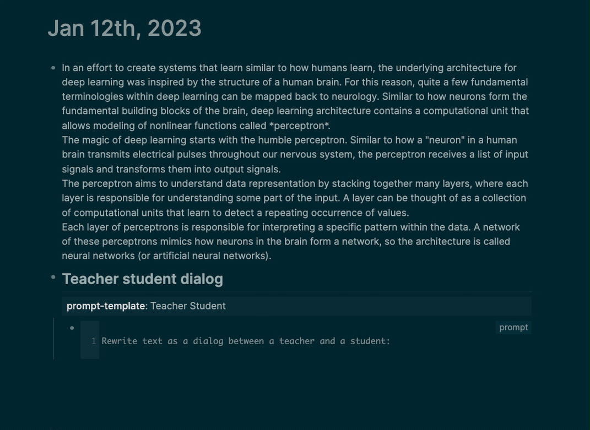

#### Australian Accent
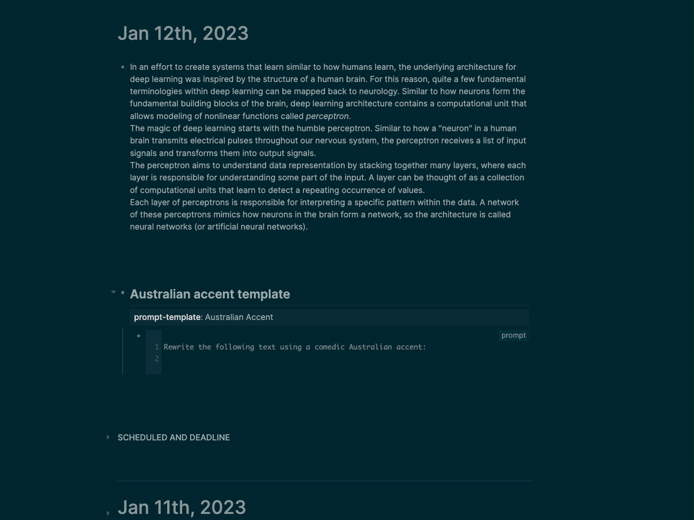
### Replace
To replace the selected block with the generated text, click the `Replace` button.


### Regenerate

If you don't like the output of the prompt, you can click the `Regenerate` button to generate a new response. Sometimes the first response is not the best, but the second or third response can be better.
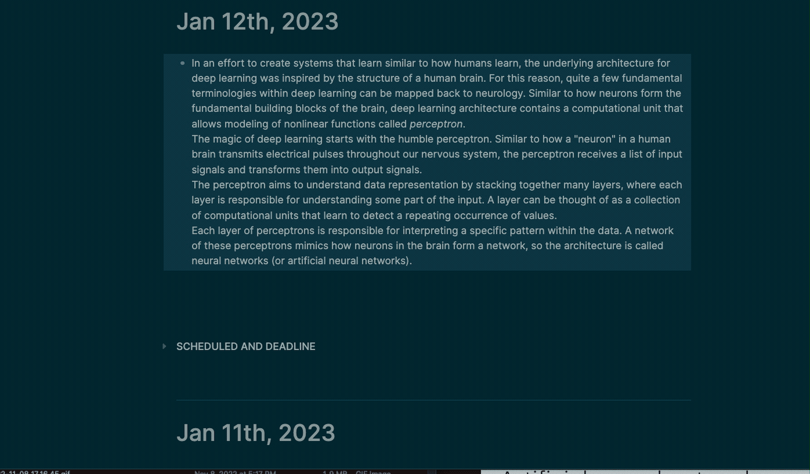

## `gpt-block`

Type `/gpt-block` in a block or select `gpt-block` from the block menu.

`gpt-block` will send the block to OpenAI's GPT-3 API and append the response underneath the block.

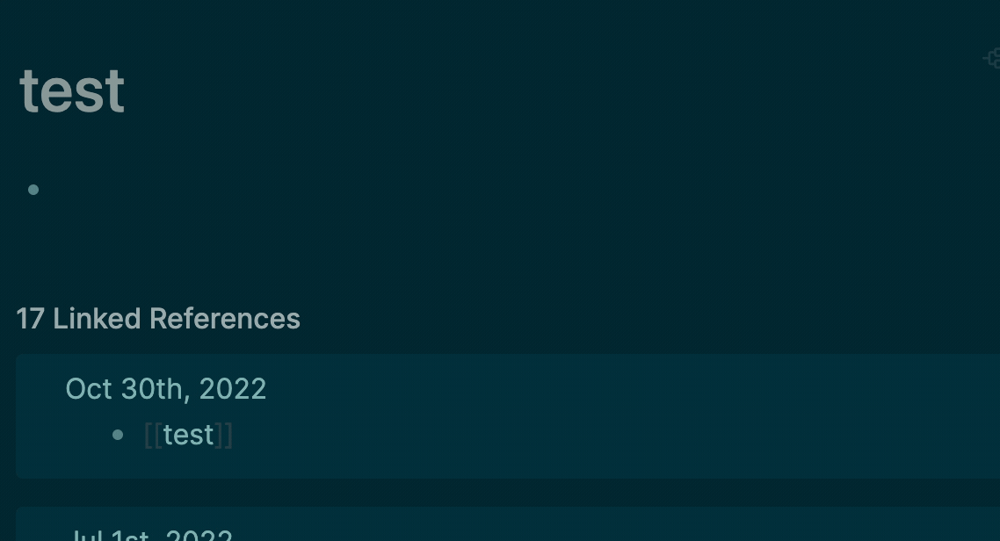
#### Summarizing or explaining a block of text


### `gpt-page`

Type `/gpt-page` in a block or select `gpt-page` from the block menu.

`gpt-page` will send the entire page to OpenAI's GPT-3 API and append the response to the bottom of the page.

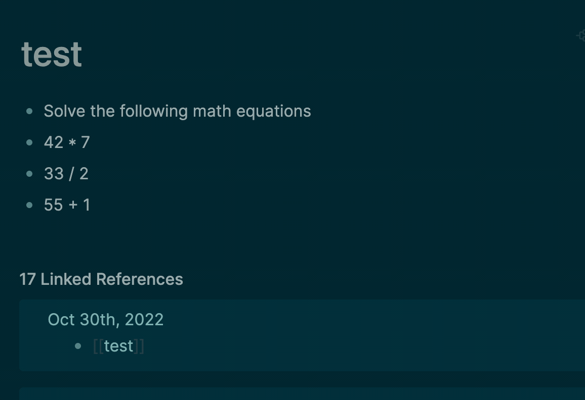

### `dalle`

Type `/dalle` in a block or select `dalle` from the block menu.

This will generate an image using the DALL-E model, save the image to the `assets` folder, and insert the image into the block.

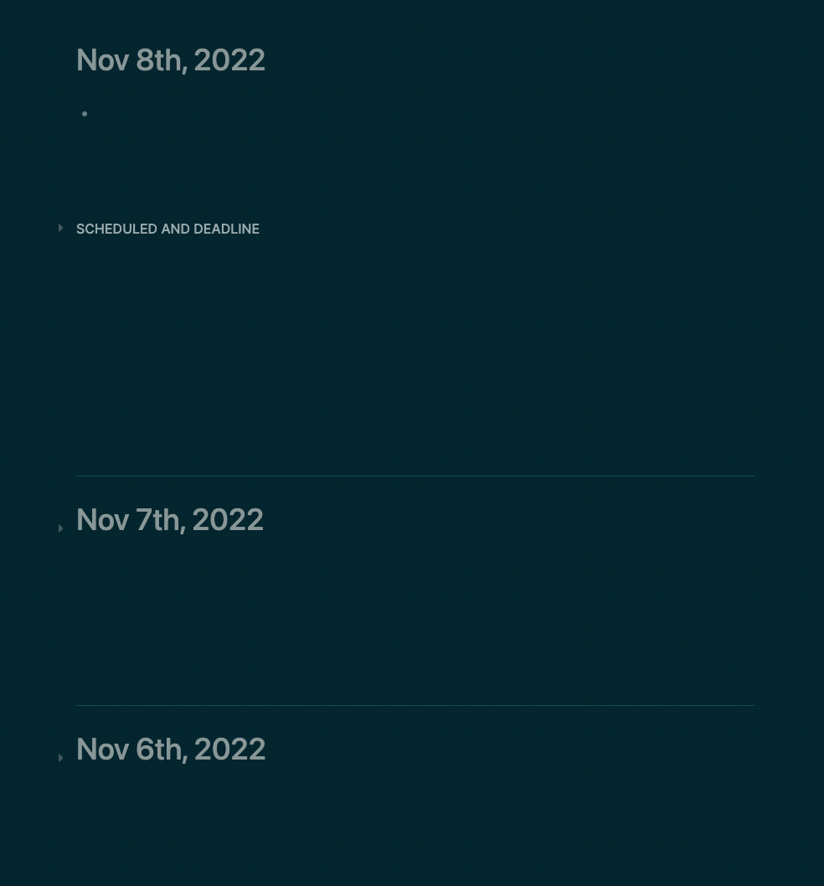

### Inject Prefix

Allows you to inject a prefix into the GPT-3 output before it is inserted into the block, such as a [[gpt3]] tag or markdown formatting like `>` for a blockquote. This is useful for identifying blocks that were generated by GPT-3.
Use the `Inject Prefix` options in the setting to set the prefix. You can add a space or `\n` newline to separate the prefix from the generated text.

#### Inject Tag


#### Inject Markdown Blockquote


### OpenAI Examples

[See here for example usages](https://beta.openai.com/examples).

## 📝 Table of Contents

- [About](#about)
- [Examples with GIFs](#examples)
- [Getting Started](#getting_started)
- [Deployment](#deployment)
- [Usage](#usage)
- [Built Using](#built_using)
- [TODO](../TODO.md)
- [Contributing](../CONTRIBUTING.md)
- [Authors](#authors)
- [Acknowledgments](#acknowledgement)

## About <a name = "about"></a>

`logseq-plugin-gpt3-openai` allows users to generate human-like text using GPT-3 within the LogSeq editor.

Write a GPT-3 command in a block, then run the open `/gpt` command via the slash or block menu. The plugin will generate a GPT-3 response using the OpenAI API and insert it below. It removes leading and trailing whitespace from the prompt.

## Getting Started <a name = "getting_started"></a>

- You need to [get an OpenAI API Key here](https://openai.com/api/) and add the key in the plugin settings.

- Make sure you [read OpenAI's usage guidelines](https://beta.openai.com/docs/usage-guidelines) and avoid generating certain types of content.

- Download the plugin in the Logseq marketplace by searching for `gpt3` or `openai`.

## ⚠️ Warning ⚠️

GPT-3 has limitations. It sometimes produces output that is subtly wrong or misleading. Don't rely on its output without verifying it yourself. Use it with caution.

## Example Use Cases <a name = "examples"></a>

## Summarizing or explaining a block of text


## Creating bullet point outlines for a given topic

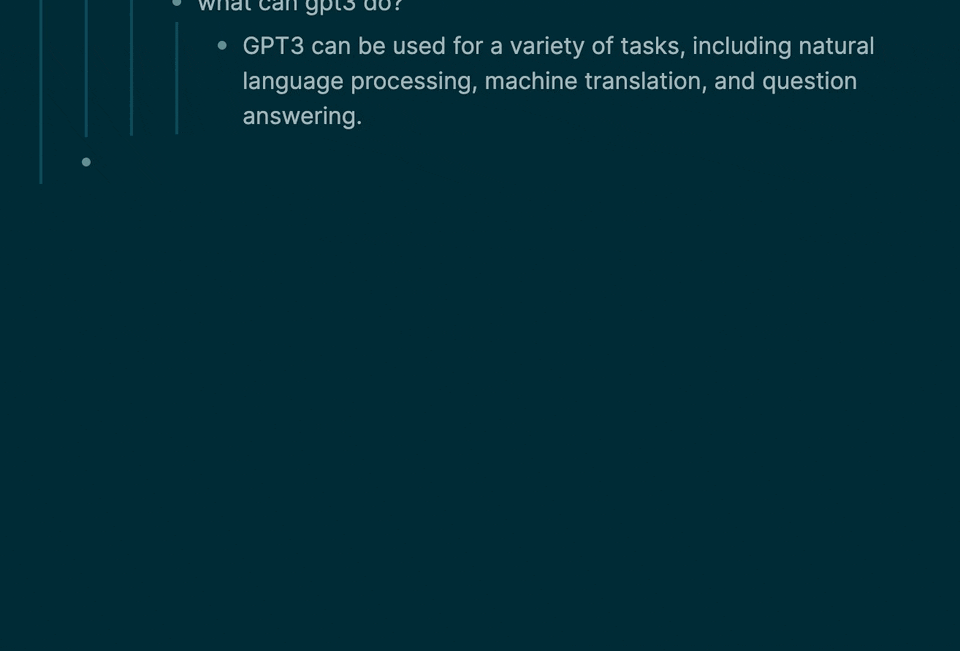

## Creating study plan for a given topic


## Write a travel itinerary


## Explain how to do something


## Parse tabular data from plain english

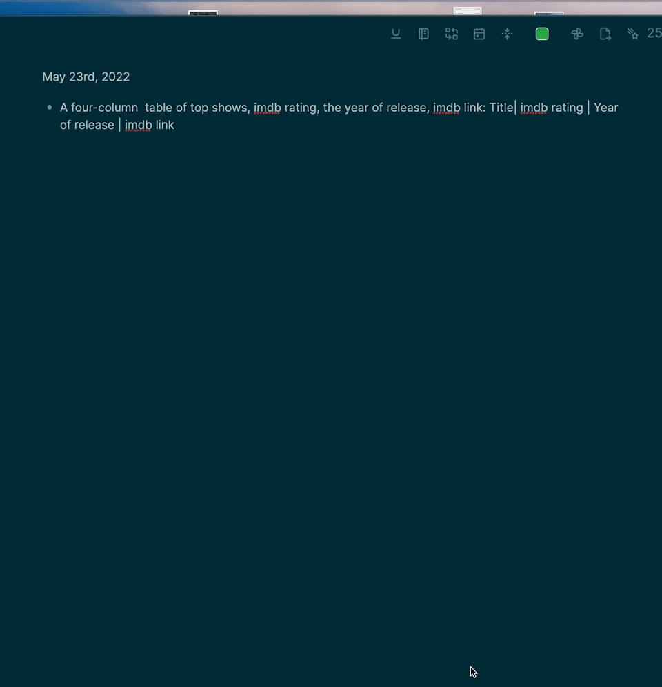

### Just for fun


- Generate code to do a given task
- Correct grammar
- Translate into other languages

- Classification and keyword tagging of text
- Generate lists of given topics
  - `List 10 top selling science fiction books`
- Write about a given topic
  - `Write a tagline for an ice cream shop.`
- Answer Questions
  - `Q: How does a telescope work?`

## FAQ <a name = "faq"></a>

### What is GPT-3 and OpenAI, and how does it work?

See [this article for a good overview.](https://www.vox.com/future-perfect/21355768/gpt-3-ai-openai-turing-test-language)

### Errors

#### OpenAI Quota Reached

Your free trial is over, or you've run out of tokens. You can refill your tokens [here](https://beta.openai.com/account/billing/overview).

#### `OpenAI Rate Limited`

OpenAI has limits on how often you can call them. If you get this error, you'll need to wait a bit before trying again. See this [article](https://help.openai.com/en/articles/5955598-is-api-usage-subject-to-any-rate-limits) for more info on the rate limits. You can call it faster if you have a paid account.

#### `Refused to set unsafe header "User Agent"`

This error doesn't cause any issues besides the error message in the console. It's a known issue with the OpenAI API. See [this issue](https://github.com/openai/openai-node/issues/6) for more details. I'm working on a PR to their library to support browser usage. Ignore this error for now.

### Debugging

]

- Open the developer tools (Menu -> View -> Toggle Developer tools)

- Check the console logs for error messages.

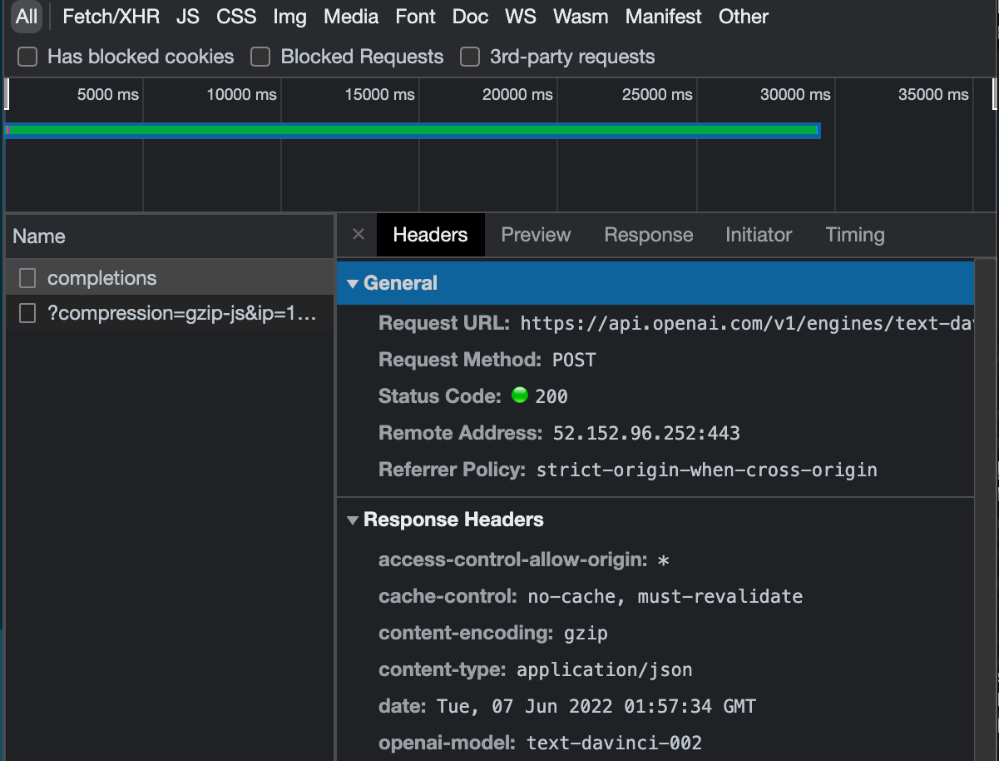

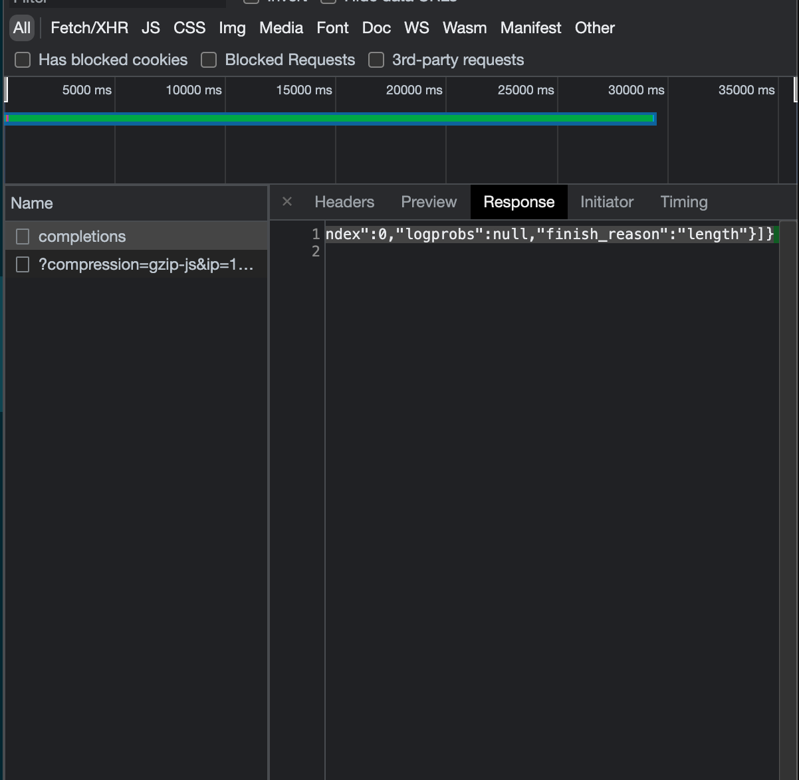

- See if you can figure out the error on your own. Maybe you had a network issue if it says something like "timed out." Sometimes the OpenAI API has issues. You also have a limited number of tokens, so you may run out and need to refill.

- If you can't figure it out based on the error message and it doesn't go away. Make an issue on GitHub.

### Prerequisites

[An API key from OpenAI Click here to get one](https://beta.openai.com/account/api-keys)

### Installing

```
npm i
```

## Running the tests <a name = "tests"></a>

- [ ] Add Tests

## Build <a name="usage"></a>

```
npm run build
```

## 💻 Local Development

This enables the local dev server with hot reloading, via the logseq vite plugin.

```
npm i
npm run dev
```

### Prod build

First run `npm i` and `npm run build`

Open LogSeq

Go to Settings > Turn on Developer Mode

This will bring up the "Plugins" entry in three dots more menu list on the top right of the head bar. Go to Plugins page, and you will get a button with the `Load unpacked plugin label`. Select the root folder of this plugin repo.

Make sure you add your [OpenAI Key](https://beta.openai.com/account/api-keys)

## 🚀 Deployment <a name = "deployment"></a>

Creates a build using semantic release when a commit is pushed with a smart commit message.

## Built Using <a name = "built_using"></a>

- [LogSeq](https://logseq.com/) - Privacy-first, open-source knowledge base that works on top of local plain-text Markdown and Org-mode files.
- [Vite](https://vitejs.dev/) - Next Generation Frontend Tooling

## Contributing <a name = "contributing"></a>

Do you have a bug or idea? I would love to hear from you! [Open a GitHub issue here.](https://github.com/briansunter/logseq-plugin-gpt3-openai/issues/new)

PRs welcome. [Open an issue](https://github.com/briansunter/logseq-plugin-gpt3-openai/issues/new) to discuss first if possible.

## Authors <a name = "authors"></a>

- [@briansunter](https://github.com/briansunter) - Author

## Acknowledgements <a name = "acknowledgement"></a>

- [OpenAI Examples](https://beta.openai.com/examples)
